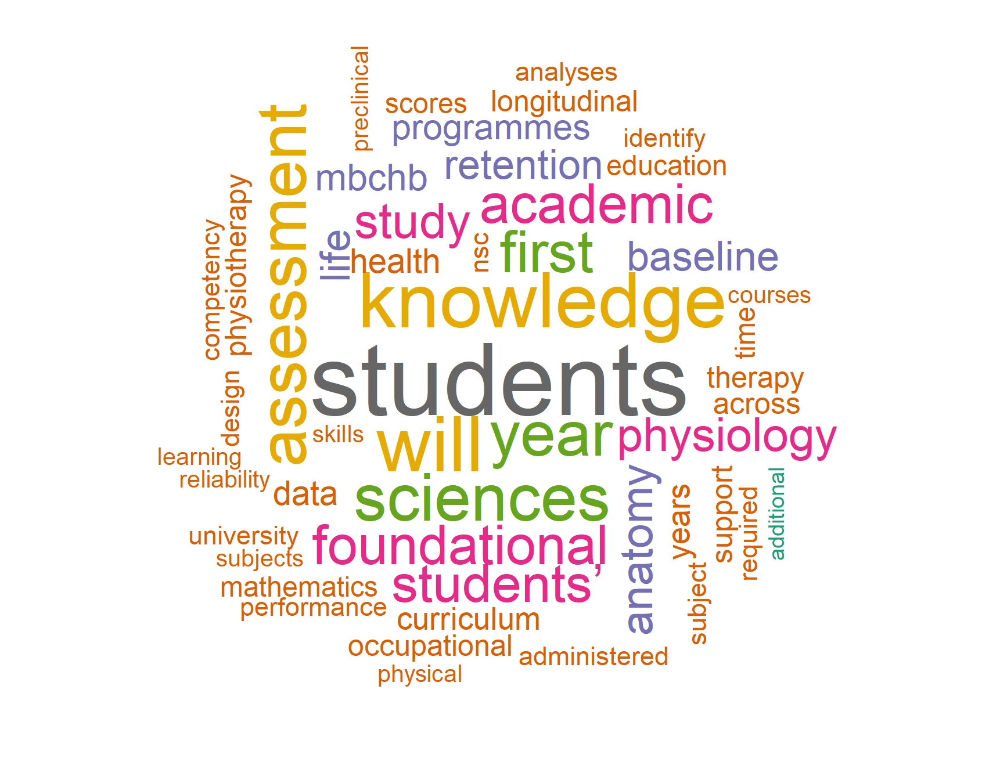
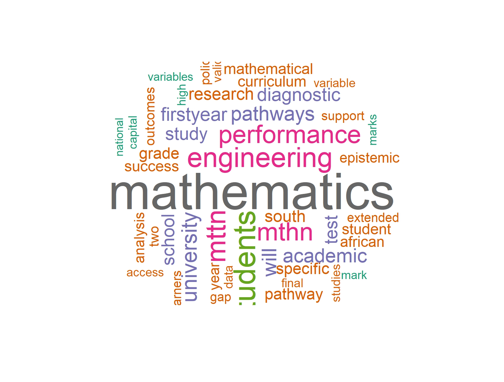

**Research projects**

A Longitudinal Study on the Retention of Foundational Knowledge in Anatomy and Physiology Among Health Sciences Students in South Africa

Mathematics Pathways and Epistemic Access: First-Year Engineering Mathematics Success at a South African Comprehensive University

